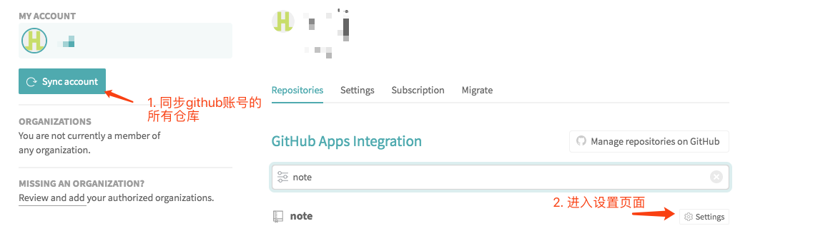
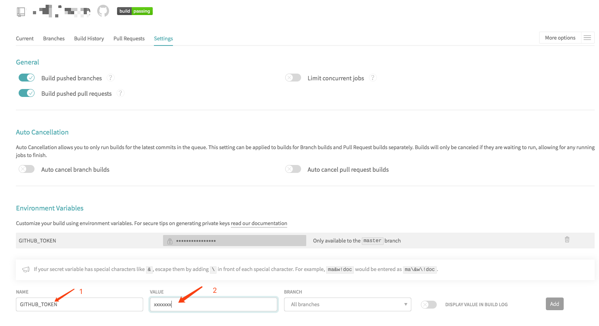

# 使用 vuepress + github page + travis 搭建博客

重点记录的是如果使用 `travis` 进行持续化集成和部署，需要了解如何使用 vuepress，可以前往[官网](https://vuepress.vuejs.org/zh/)写得非常的详细。

1. 如果需要根路径访问项目那么需要将仓库的名称改为`<USERNAME>.github.io`
2. 项目根目录添加`.travis.yml`

<<< @/.travis.yml

3. 参照 [github 官方教程](https://help.github.com/en/github/authenticating-to-github/creating-a-personal-access-token-for-the-command-line) 生成一个 `Personal access tokens`(全英文，看不到没关系，看图就行)，一定记得**复制下来**，**复制下来**，**复制下来**

4. 使用`github`账号登录[travis](https://travis-ci.com/)后，进入[这个地址](https://travis-ci.com/account/repositories)，按照如下图操作

 图一

 图二

5. 上图二中`1`填写根目录`.travis.yml`中的`github_token`字段的值(不要\$)，`2`填写“步骤 3”生成的`Personal access tokens`

6. 万事具备，推送一次提交试试。
